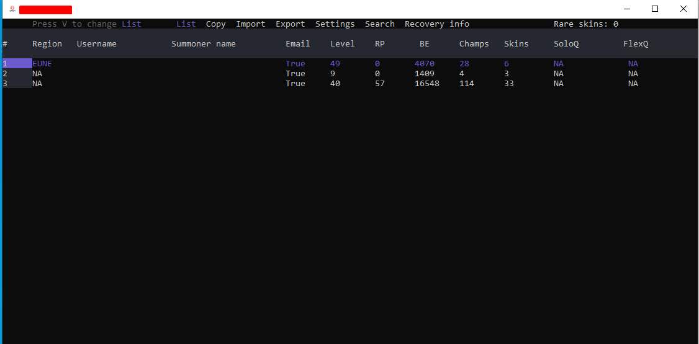
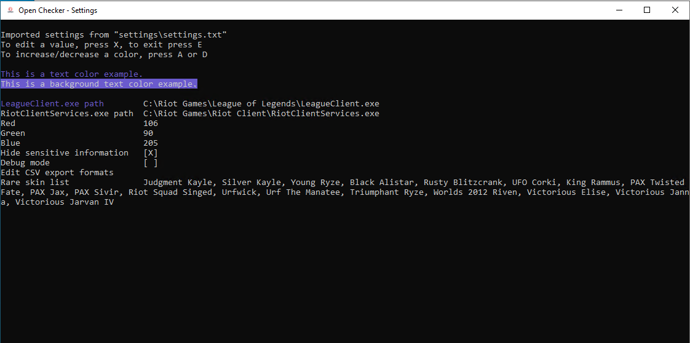
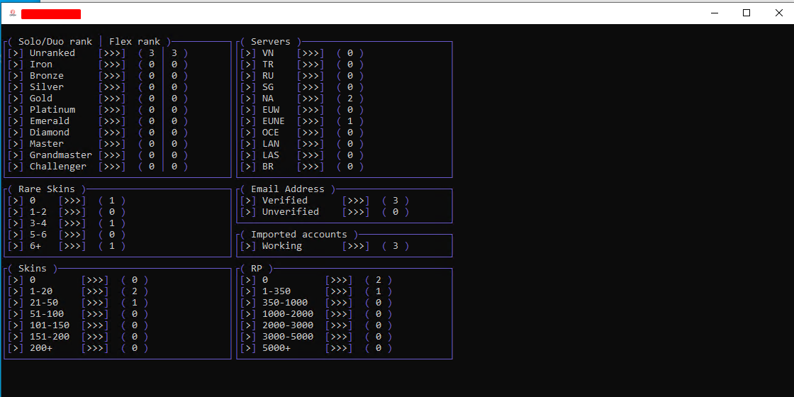
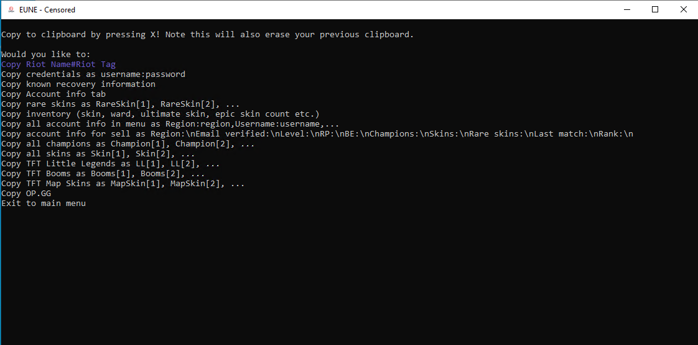
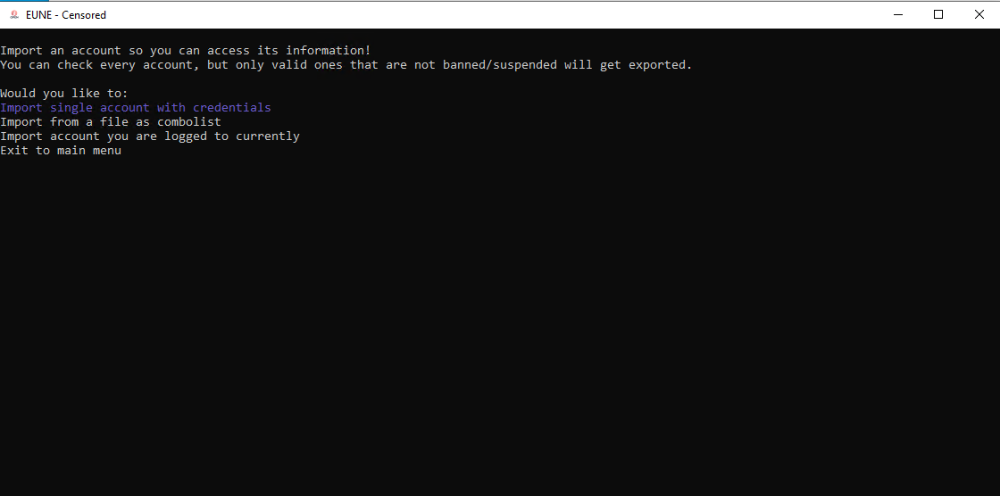
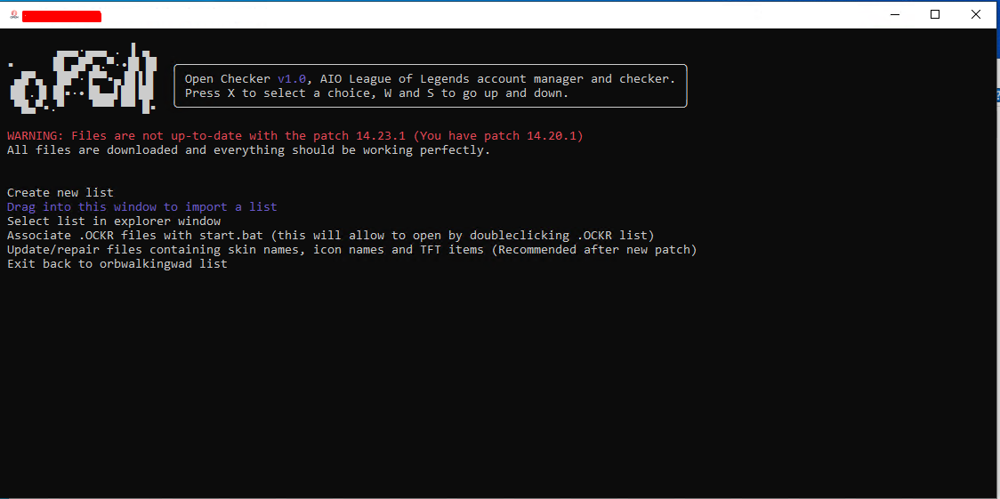
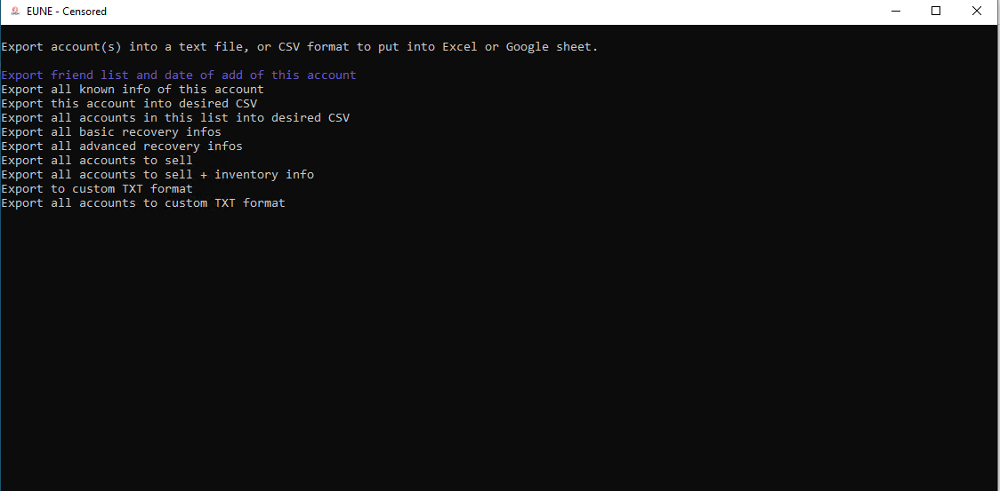

# Open Checker


Open Checker is an all-in-one solution for managing League of Legends accounts.

My biggest project that took me 6 months of constant coding to finish. I started this with no prior experience in LCU or RC API's for League.

If importing accounts does not work for you, run PowerShell as administrator and type `Set-ExecutionPolicy RemoteSigned`.

NOTE: I have used OC on my main machine before and after Vanguard without any punishment, but I can not tell if it is gonna be bannable in the future. Use at your own risk!

NOTE 2: While importing, it will ask you for account password to find the creation date, last password change date and other info. This was unfortunately recently patched by Riot.


## 🌟 Overview

### Main Tab Information:
- **Account Details:**
  - Region, Username, Summoner Name, Email, Level
  - RP, BE, Champion Count, Skin Count, Rare Skin Count
  - Solo/Duo Rank, Flex Queue Rank
- **Customizable rare skin list:** customizable in `settings\rare_skins.txt`.

### **Tabs for Actions**:
1. **Copy to Clipboard**: Easily copy details like account info, recovery information, inventory, or champions and skins.
2. **Import Accounts**: Add accounts from combolists, files, or current logged session.
3. **Export Accounts**: Export details in formats like CSV, with 100% customization.
4. **Settings**: Possible to change GUI color, hide sensitive info, edit export formats, and more.
5. **Search**: Currently broken :(
6. **List**: View statistics about all the imported accounts (rank, rare skins, skins, servers...)

---

## 🔥 Features

### **Copy Features**
- Copy account credentials as `username:password`.
- Copy all champions or skins as `Champion[1], Champion[2], ...` or `Skin[1], Skin[2], ...`.
- Able to copy any important info to clipboard

### **Import Features**
- Import accounts:
  - From combolists (e.g., `username:password` format).
  - Current session accounts directly from the League client.

### **Export Features**
- Export data such as:
  - Champion and skin lists with obtain dates.
  - Detailed account stats to CSV/TXT or other desired format.
  - Ranked details (Win/Loss/LP/Decay).
  
### **Detailed Account Information**
- For each imported account, Open Checker collects:
  - Creation date, Honor level, XP boost expiry, Ranked restrictions.
  - Full inventory data (Skins, Champions, Icons, etc.).
  - Riot API IDs (`accountId`, `summonerId`, `puuid`).
  - Ranked data for all game modes (Solo/Duo, Flex, TFT, etc.).

---

## ⚙️ Customization
- Change GUI colors for a personalized look.
- Enable "Hide Sensitive Information" for safe streaming or screenshots.
- Debug mode for troubleshooting issues.
- Configure paths for `LeagueClient.exe` and `RiotClientServices.exe`


# Open Checker Usage Guide

## Controls and Navigation

### General Navigation
- **Scroll through options:** `W` (Up), `S` (Down)
- **Select option:** `X`

---

### Main Menu Actions
- **Change Account Database:** `V`
- **Autologin:** `A`
- **Switch Tabs (Copy <-> Import):** `Q` (Left), `E` (Right)

---

### Account Database
- **Scroll through accounts:** `W` (Up), `S` (Down)
- **Select account:** `X`

---

### Account Information
- **View more details about an account:** `R`
- **Back to Main Menu:** `E`

---

### Champions/Skins/Icons/TFT Items/URS
- **Scroll through items:** `W` (Up), `S` (Down)

---

### Copy/Import/Export/Settings/Search
- **Select from Main Menu:** `X`
- **Return to Main Menu:**
  1. Scroll using `W` and `S` to "Exit to Main Menu."
  2. Press `X`.

---

# Account Saving System

## Overview
OC saves account data in plain text. No passwords or other private info are encrypted.

---

## Structure
- **Account Start/End Tags:**  
  Each accounts data is encapsulated with `account-<number>-start` and `account-<number>-end` tags to separate individual accounts.

- **Indexing:**  
  Each field is indexed by account ID:
  - `login[1]`: Login information for the first account.
  - `login[2]`: Login information for the second account.

---

## Format
  - All account data are in file `listname.ockr` (.ockr is the extension for Open Checker data files)
  - Files with other extensions can not be used as Open Checker data files.

---

## Example
```plaintext
account-1-start
login[1]=exampleLogin
region[1]=NA
email[1]=example@email.com
skinsamount[1]=5
skin_name[1][1]=PAX Jax
skin_name[1][2]=Neo PAX Jax
account-1-end
```

## More screenshots (all are available in showcase\)






